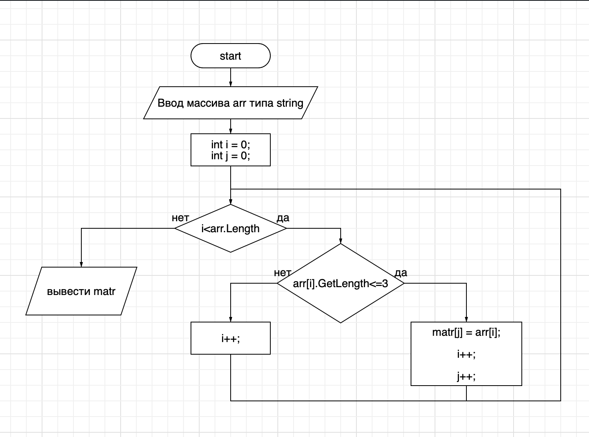

# Эта программа является выпускной контрольной работой Ольги Мигаль по выбору специализации курса ИТ-инженер GeekBrains.

## Задача:
Написать программу, которая из имеющегося массива строк
формирует массив из строк, длина которых меньше либо равна 3 символа.
Первоначальный массив можно ввести с клавиатуры, либо задать на старте
выполнения алгоритма. При решении не рекомендуется пользоваться
коллекциями, лучше обойтись исключительно массивами.

## Задание:
1. Создать репозиторий на GitHub
2. Нарисовать блок-схему алгоритма (можно обойтись блок-схемой
основной содержательной части, если вы выделяете её в отдельный метод)
3. Снабдить репозиторий оформленным текстовым описанием решения (файл README.md)
4. Написать программу, решающую поставленную задачу.
5. Использовать контроль версий в работе над этим небольшим проектом ]
(не должно быть так, что всё залито одним коммитом, как минимум
этапы 2, 3, 4 должны быть расположены в разных коммитах).

<u>**_В своей работе я старалась придерживаться принципов YAGNI и KISS._**</u>

## Комментарий:

Представленная  блок-схема задачи иллюстрирует общий алгоритм
без учёта особенностей кода C#. Таким образом, она не дублирует программу, а лишь задаёт некоторым ориентиром логику решения.